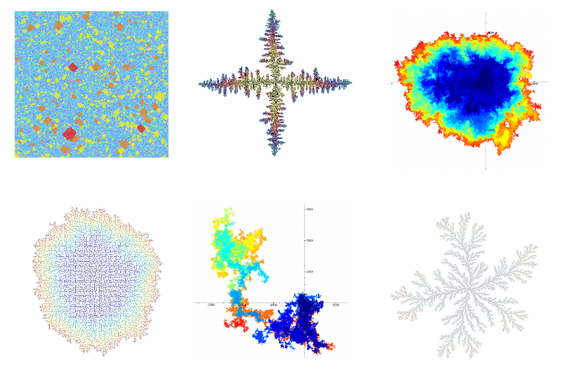

# mtools: my maths toolkit

- Author:   Arvind Singh ([mail](mailto:arvind.singh@math.u-psud.fr) , [www](http://www.math.u-psud.fr/~singh/))
- git repo: https://github.com/vindar/mtools
- License:  [GPLv3](http://www.gnu.org/licenses/gpl-3.0.html)

### About

This repository contain a collection of C++ classes I created for simulations (mostly of exotic stochastic processes) and for displaying graphics. It consists of code that I accumulated over the years which I finally decided to gather inside a library. 

Using the library is straightforward. Every class/function is located under the `mtools` namespace. The `#include "mtools.hpp"` directive includes all other required headers of the library which, itself, is divided in several components:

  - **randomgen/** : Implementation of some classical random number generators such as the Mersenne Twister, Xorgen... and some classes to generate specific probability distributions such as stable laws, distribution of SRW...

  - **maths/** : Classes for representing rectangles, vectors, matrices, graphs, combinatorial maps and such... 

  - **io/** : Contains stuff related to input/output. In particular, 
    - `IBaseArchive`/`OBaseArchive`. Classes used for serialization of objects in the spirit of boost::serialization but much simpler, without forward serialization of pointer type but with the possibility of including comments to improve the readability of the archive. Serveral derived classes are defined depending on the archive type (eg file, string...)
    - `Console`. Class which displays a text console that can also log into a file. The console can be used for simple text input/output. A global `mtools::cout` object is defined which can be used as a substitute for std::cout/std::cin.
    - `LogFile`. A simple class for text logging into a file.
    - `WatchWindow`. Create a window which display the value of variables to spied upon in real time. It is even possible to change the values on the fly (usually a good way to crash the program). A global object `mtools::watch` is defined to be used as the default spy window. 
    - A simple parser for command line arguments...

  - **containers/** : This directory contain template classes used for holding objects (in the spirit of the stl containers).
    - `Grid_basic`/`Grid_factor`. Template classes which simulates an infinite d-dimensional grid Z^d where each vertex of the grid holds an object of the template type. The grid is dynamically constructed when objects are read/accessed and the internal structure is similar to that of an octree with some additional refinements. The whole grid can copied and saved/read from a file. The Grid_factor version also permits 'factorization' of objects (i.e. the same object can be re-used for distinct positions in the grid). I find this class particularly useful when simulating multi-dimensional processes such as random walks, growing domains, percolation processes, interacting particle processes etc...
    - Other outdated container classes such as `RWtreegraph`, `randomurn` ...  I plan to rewrite them from scratch at some point...

  - **graphics/** This is the biggest part of the library. First, every drawing is done inside a `Image` object. This (huge) class defined in 'Image.hpp' represent a 2D image in RGBA32 format. The class usage is similar to CImg's image class except that the image is interlaced, making it compatible with cairo/openGL... Next several classes are defined that enable to display interactively anything that can be embedded in R^2. One advantage compared to other graphic libraries is the ability to move around and zoom while still doing the calculations. The main class is the `Plotter2D` class which displays the plotter window and manages user commands. Interaction with the plotter are performed via the keyboard using the arrow keys, page up/down and other shortcuts and with the mouse (left click & drag for zooming, right click for centering and mouse wheel for zoom level). It is possible to manage options specific for each of the drawn objects, enable or disable them, choose their drawing order, their transparencies, set the refresh rate, draw an axes system, draw a grid, save the image to a file, etc... Plenty of stuffs really! Each interactive command can also be set programmatically by invoking the corresponding method. The plotter draws a superposition of all the objects inserted via the operator[] methods. In order for an object to be drawable, it must implement the `Plotter2DObj` interface which is, itself, a variation of the `Drawable2DObject` interface with additional methods needed to define a drop-down plot-specific option menu. You can create you own class derived from  `Plotter2DObj` if you wish but, in most case, you can fall back on using one of the predefined sub-classes:
    - `Plot2DLattice`: Encapsulate a two-dimensional integer (rectangular) lattice. You must provide a function which takes an integer position (i,j) and returns a color. Optionally, you can also indicate another function which takes a position and returns a CImg image associated with the site. In this case, the site images are used when zooming on a small portions of the lattice (switching between drawing modes can be done in real time using the plot drop-down menu). Check the 'OERRW_2D', 'iDLA_2D', 'eDLA_2D' or 'LERRW_2D' demos in examples/ directory to see how to use this class.
    - `Plot2DPlane`: Encapsulate a 2D plane R^2. You must provide a function which takes an real-valued coordinate (x,y) and returns a color. Check the 'Mandelbrot' project for an example.
    - `Plot2DCImg`: Encapsulate a CImg image. Check the 'ImageViewer' project for an example.
    - `Plot2DFun` : Draw the graph of a function. Take any function of the form T f(U) where T and U are convertible to double. Several drawing options are available in the plot drop-down menu. Check the 'SRW_1D' project for an example.
    - `Plot2DArray` : Encapsulate a one-dimensional C-array. Take a T* pointer and its buffer size. Type T must be convertible to double. Several options such as the interpolation method are available in the plot drop-down menu.
    - `Plot2DVector` : Similar to `Plot2DArray` but take an std::vector<T> instead of a raw pointer as parameter. This permits the vector size to change even while being plotted. You can choose how changing the vector size affects plot range. Check the 'SRW_1D' project for an example.
    - `Plot2DGrid` and `Plot2DAxes` : Define an object that draws a custom grid/axes coordinate. Normally, you do not need to create instances of these classes since you can always add or remove grid/axes objects directly from the plotter.

  The easiest way to create objects of the types described above is to call one of the global factory functions 'makePlot2Dxxx()'. See the documentation alongside the declarations in the header files for additional details...  
  
  - **misc/** Contains general purpose code. Some header files you might want to have a look at:
    - 'timefct.hpp' : Contain methods dealing with time. In particular, class `ProgressBar` display a progress bar window.
    - 'memory.hpp' : Class `SingleAllocator`. A simple but very fast memory allocator.
    - 'metaprog.hpp' : Contain several meta-programming tricks for detecting existence of member functions/operators.
    - 'error.hpp' : Contain functions and macros for dealing with errors.
    - 'stringfct' : contain various functions for manipulating string. In particular, the `toString()` method used to convert any object into a string.

### Documentation
Information about a class or a method should be located in the corresponding header file, above its declaration. Comments are, more or less, in doxygen format: you can use the `Doxyfile` configuration file to build the documentation for the whole library using doxygen.

### Examples
The directory contain standalone projects demonstrating how to use the library. It mostly consist of simple simulations of stochastic processes such as interacting particle systems, percolation, DLA, interacting random walks...

### Building the library
The library is cross-platform. It works under Linux (GCC) and Windows (VS2015) and OSX (Clang) but it depends on a few other libraries, mainly [CImg](http://cimg.eu/), [FLTK](http://www.fltk.org) and optionally [openCL](https://www.khronos.org/opencl). The library uses several C++11 features. Hence a (fairly) up to date compiler is required to build it. To simplify the build procedure with Visual Studio, the repository [mtools-dependencies](https://github.com/vindar/mtools-dependencies) contain VS2015 builds of all the required libraries. See the file '[INSTALL.TXT](https://github.com/vindar/mtools/blob/master/INSTALL.TXT)' for detailed instructions.
Once the library is installed, the python script `mtoolsproject.py` can be used to created new projects set up to use the library.

### What else...
If you are looking for a nice C++ library that you can use to create simulation and graphics, I strongly recommend that you look at [Vincent Beffara's simulation library](http://github.com/vbeffara/Simulations). It is very similar to mine and does pretty much the same things. If I had known about it a few years ago, I would probably now just use it and would never have written this one... In fact, while putting this library together, I borrowed the ideas of 'watch windows' and simple command-line parser from Vincent's library. There are many other neat features so go have a look at it.

